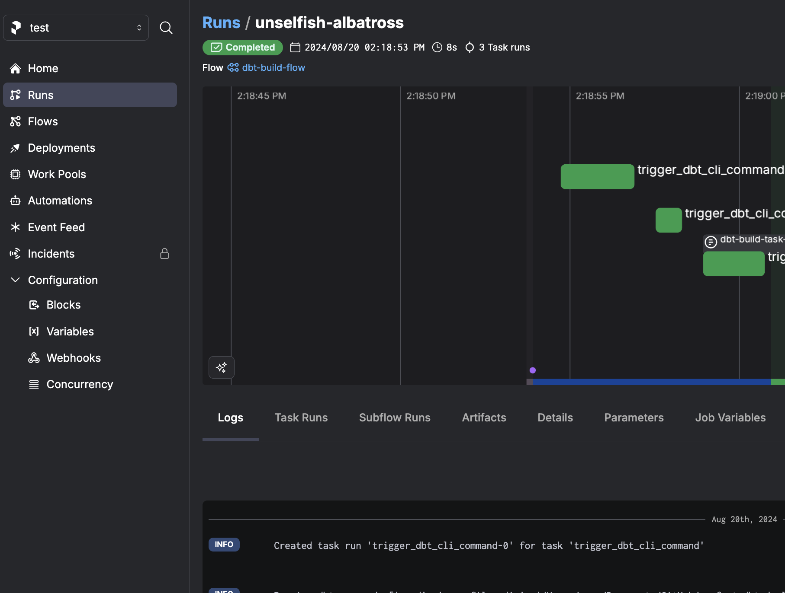
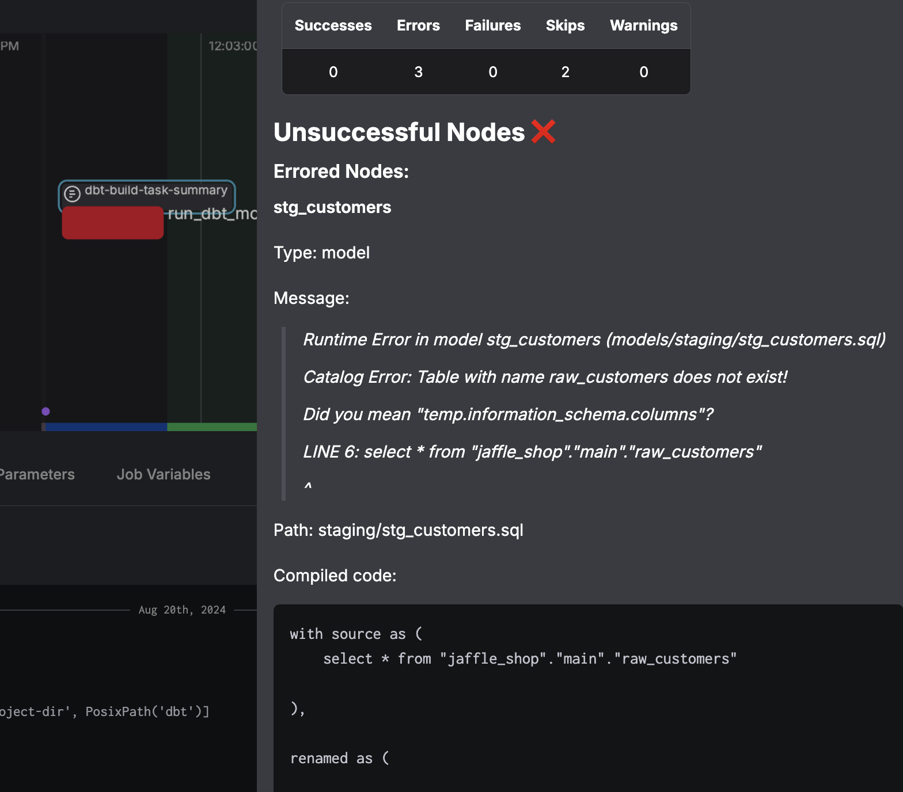

# Overview

🚨 Work in progress

This repository contains a demo Prefect flow that clones a dbt project and runs a dbt Core commands as Prefect tasks. 

The flow at `duckdb-flow.py` clones a fork of dbt Labs' Jaffle Shop example, but with duckdb so it doesn't require connecting to a data warehouse.  

## Setup and installation

Clone the repository
I used `uv` for this demo. Because this uses a Prefect 3 release candidate, `--prerelease=allow` is required. 

After creating a virtual environment, install the requirements.
`uv pip install -r requirements.txt --prerelease=allow`

## Usage

Once installed, run `python duckdb-flow.py` to run the flow and dbt tasks. 

The cloned repository, https://github.com/seanpwlms/jaffle_shop_duckdb.git has another branch, `model_error` so you can see what a failure looks like as a Prefect artifact. Cloning different branches can also be combined with prefect web hooks as the basis for dbt Core CI jobs

To use this with your own dbt project repository, replace the URL in the `clone_dbt_repo` function and add [credentials](https://docs-3.prefect.io/integrations/prefect-github/index)

### Deploying 