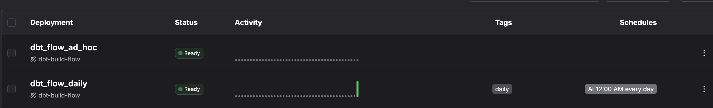

# Overview

This repository contains a demo Prefect flow that clones a dbt project and runs dbt Core commands as Prefect tasks. 

The flow at `duckdb-flow.py` clones a fork of dbt Labs' Jaffle Shop example, but with duckdb so it doesn't require connecting to a data warehouse.  


## Setup and installation

Clone the repository
I used [`uv`](https://github.com/astral-sh/uv) for this demo to speed up the installation process. 

After creating a virtual environment, install `uv` if not already installed.
`pip install uv`

Install the other required packages.
`uv pip install -r requirements.txt`

## Usage

Once installed, run `python duckdb-flow.py` to run the flow and dbt tasks. 

To see what a failure looks like as a Prefect artifact, switch to the  `model_error` branch of this repository (https://github.com/seanpwlms/jaffle_shop_duckdb.git). 


To use this repo with your own dbt project repository, replace the URL in the `clone_dbt_repo` function and add [credentials](https://docs-3.prefect.io/integrations/prefect-github/index).

### Deploying 

Let's use Prefect's serverless execution environment.  First, create a Prefect Managed work pool.  

`prefect work-pool create managed-pool --type prefect:managed`

Because the repo has a `requirements.txt` file and Prefect Managed workpools don't easily install from a `requirements.txt` file, we'll create a deployment through a [`prefect.yaml` file](https://docs.prefect.io/latest/deploy/infrastructure-concepts/prefect-yaml) and specify the requirements as a part of the pull step.

Alternatively, We could modify `duckdb-flow.py` to create a schedulable deployment through Python code by specifying the packages to install in the `deploy` method:

```python
if __name__ == "__main__":
    flow.from_source(
        source="https://github.com/seanpwlms/prefect-dbt-deployment.git",
        entrypoint="duckdb-flow.py:dbt_build_flow",
    ).deploy(
        name="test-managed-flow",
        work_pool_name="managed-pool",
        job_variables = {
    "pip_packages": [
        "prefect==3.0.0",
        "prefect-dbt==0.6.0",
        "prefect-github==0.3.0",
        "dbt-duckdb==1.8.3",
        "google-auth==2.34.0",
        "duckdb==1.0.0"
    ]
}
    )
```

Create a deployment without a schedule:

`prefect deploy --name dbt_flow_ad_hoc`

Or, deploy the flow with a daily schedule:

`prefect deploy --name dbt_flow_daily`

Then, see the deployments in the UI.



### Extensions

To run dbt Core CI jobs you can combine the examples in other branches of this repo with Prefect webhooks.
